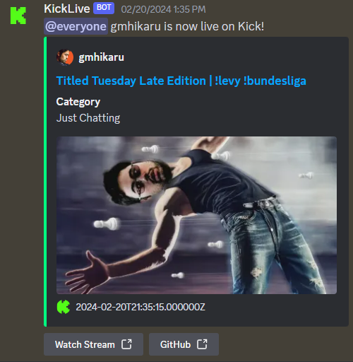

# KickLive

A discord bot that sends message to channel whenever a livestream is on.

## Screenshots

## Technologies

Written using [Node.js](https://nodejs.org/) and [Typescript](https://www.typescriptlang.org/).

### Details

Uses [Pusher](https://pusher.com/) websockets to listen to events and sends them to discord api to specific subscribed channels.

### Database

Uses [Sequelize](https://sequelize.org/) ORM based on [SQLite](https://www.sqlite.org/) to store channel and stream data.

## Status

Not fully ready to be deployed yet! Trying to find a cheap hosting server to be deployed on.
